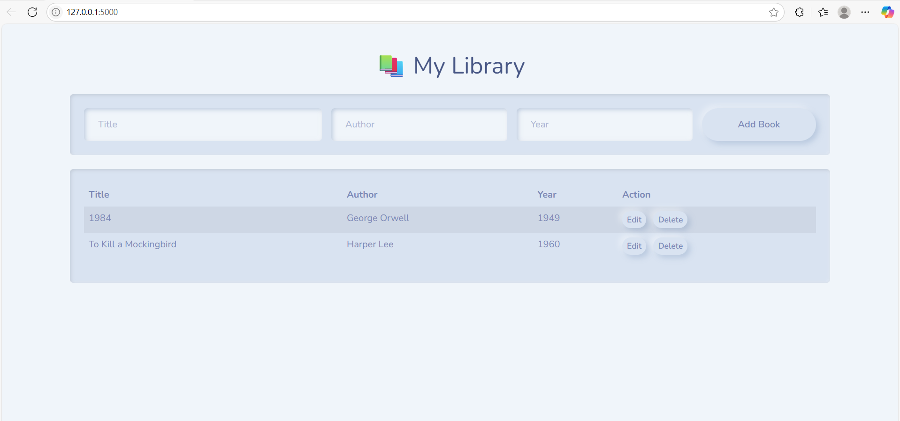

# My Library Project

## Implementation

For this project, I built a simple personal library web application that allows users to view, add, and delete books. The project consists of three main parts:

- **Backend:** Developed using Python and Flask, which handles HTTP requests, interacts with an SQLite database, and serves HTML, CSS, and JavaScript files.
- **Database:** Used SQLite to store book records with fields for title, author, and year. The database is initialized with two default books.
- **Frontend:** Built with HTML, CSS (Bootstrap), and JavaScript. The frontend sends requests to the backend to fetch book data and update the UI dynamically without page reloads.

The application supports adding new books through a form, displaying all books in a table, and deleting books using buttons. The UI shows notifications to confirm actions.

## Challenges

- **First time with Flask and Python Web Development:** I had limited prior experience with Flask, which meant learning about routing, request handling, and serving static files from scratch.
- **Database Integration:** Setting up SQLite and connecting it to Flask was new to me. I had to learn how to create tables, insert data, and query the database securely.
- **Asynchronous JavaScript:** Implementing fetch API calls to communicate with the backend and update the DOM dynamically took some trial and error.
- **Handling POST Requests and Redirects:** Managing form submissions, processing POST data in Flask, and redirecting the user smoothly was a bit tricky initially.
- **State Management:** Making sure the UI accurately reflected database changes (like after deleting a book) required careful coordination between frontend and backend.

## What I Learned

- **Flask Basics:** How to set up routes, handle GET and POST requests, serve static files, and return JSON responses.
- **SQLite Database Operations:** Creating tables, inserting, querying, and deleting records using SQL commands in Python.
- **Frontend-Backend Communication:** Using JavaScript’s fetch API to asynchronously get and send data between the client and server.
- **Building Responsive UIs:** Using Bootstrap for layout and styling and manipulating the DOM with JavaScript to provide a smooth user experience.
- **Debugging and Development Workflow:** Running the Flask development server, understanding error messages, and iterating on code to fix bugs.

This project gave me practical experience with full-stack web development and a better understanding of how frontend and backend components interact in a real-world app.

